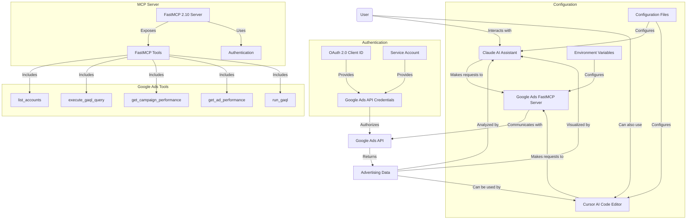

# Google Ads MCP


A tool that connects [Google Ads](https://ads.google.com/) with Claude AI, allowing you to analyze your advertising data through natural language conversations. This integration gives you access to campaign information, performance metrics, keyword analytics, and ad management—all through simple chat with Claude.

This project has been recently upgraded to use **FastMCP 2.10**, resulting in a more streamlined architecture, improved logging, and a simplified setup process.

---

## What Can This Tool Do For Advertising Professionals?

1. **Account Management**  
   - See all your Google Ads accounts in one place
   - Get account details and basic campaign information

2. **Campaign Analytics & Reporting**  
   - Discover which campaigns are performing best
   - Track impressions, clicks, conversions, and cost metrics
   - Analyze performance trends over time
   - Compare different time periods to spot changes
   - **Visualize your data** with charts and graphs created by Claude

3. **Keyword & Ad Performance**  
   - Identify top and underperforming keywords
   - Analyze ad copy effectiveness 
   - Check quality scores and competitive metrics
   - Get actionable insights on how to improve your campaigns

4. **Budget & Bid Management**  
   - Monitor campaign budgets and spending
   - Analyze bid strategies and performance
   - Identify opportunities for optimization
   - Get recommendations for budget allocation

---

## Google Ads MCP Architecture Flow



## Available Tools

Here's what you can ask Claude to do once you've set up this integration:

| **What You Can Ask For**        | **What It Does**                                            | **What You'll Need to Provide**                                 |
|---------------------------------|-------------------------------------------------------------|----------------------------------------------------------------|
| `list_accounts`                 | Shows all your Google Ads accounts                          | Nothing - just ask!                                             |
| `execute_gaql_query`            | Runs a Google Ads Query Language query                      | Your account ID and a GAQL query                               |
| `get_campaign_performance`      | Shows campaign metrics with performance data                | Your account ID and time period                                 |
| `get_ad_performance`            | Detailed analysis of your ad creative performance           | Your account ID and time period                                 |
| `run_gaql`                      | Runs any arbitrary GAQL query with formatting options       | Your account ID, query, and format (table, JSON, or CSV)        |

### Using the Advanced Query Tools

The `run_gaql` tool is especially powerful as it allows you to run any custom Google Ads Query Language (GAQL) query. Here are some example queries you can use:

### Example 1: Basic campaign metrics

```sql
SELECT 
    campaign.name, 
    metrics.clicks, 
    metrics.impressions 
FROM campaign 
WHERE segments.date DURING LAST_7DAYS
```

### Example 2: Ad group performance

```sql
SELECT 
    ad_group.name, 
    metrics.conversions, 
    metrics.cost_micros 
FROM ad_group 
WHERE metrics.clicks > 100
```

### Example 3: Keyword analysis

```sql
SELECT 
    keyword.text, 
    metrics.average_position, 
    metrics.ctr 
FROM keyword_view 
ORDER BY metrics.impressions DESC
```

*For a complete list of all available tools and their detailed descriptions, ask Claude to "list tools" after setup.*

---

## Getting Started

### 1. Prerequisites

- [Python](https://www.python.org/downloads/) (version 3.13 or newer)
- [uv](https://github.com/astral-sh/uv) (a fast Python package installer and resolver)

### 2. Set Up Google Ads API Access

Before using this tool, you'll need to create API credentials that allow it to access your Google Ads data. You can choose between two authentication methods:

#### Option A: OAuth 2.0 Client ID (User Authentication)

Best for individual users or desktop applications:

1. Go to the [Google Cloud Console](https://console.cloud.google.com/)
2. Create a new project or select an existing one
3. Enable the Google Ads API
4. Go to "Credentials" → "Create Credentials" → "OAuth Client ID"
5. Choose "Desktop Application" as the application type
6. Download the OAuth client configuration file (`client_secret.json`)
7. Create a Google Ads API Developer token (see below)

#### Option B: Service Account (Server-to-Server Authentication)

Better for automated systems or managing multiple accounts:

1. Go to the [Google Cloud Console](https://console.cloud.google.com/)
2. Create a new project or select an existing one
3. Enable the Google Ads API
4. Go to "Credentials" → "Create Credentials" → "Service Account"
5. Download the service account key file (JSON)
6. Grant the service account access to your Google Ads accounts
7. Create a Google Ads API Developer token (see below)

#### Getting a Developer Token

1. Sign in to your Google Ads account at [https://ads.google.com](https://ads.google.com)
2. Click on **Tools & Settings** (wrench icon) in the top navigation
3. Under "Setup", click **API Center**
4. If you haven't already, accept the Terms of Service
5. Click **Apply for token**
6. Fill out the application form with details about how you plan to use the API
7. Submit the application and wait for approval (usually 1-3 business days)

### 3. Configure Environment Variables

The application uses environment variables for configuration.

1.  **Create a `.env` file**: Copy the `.env.example` file to `.env` in your project directory:
    ```bash
    cp .env.example .env
    ```
2.  **Edit the `.env` file**: Open the `.env` file in a text editor and set the following values:
    ```
    # Authentication Type: "oauth" or "service_account"
    GOOGLE_ADS_AUTH_TYPE=oauth

    # Path to your credentials file (OAuth client secret or service account key)
    GOOGLE_ADS_CREDENTIALS_PATH=/path/to/your/credentials.json

    # Your Google Ads Developer Token
    GOOGLE_ADS_DEVELOPER_TOKEN=your_developer_token_here

    # Optional: Manager Account ID (if applicable)
    GOOGLE_ADS_LOGIN_CUSTOMER_ID=your_manager_account_id
    ```
3.  **Save the file**. The application will automatically load these values when it starts.

### 4. Install and Run

With `uv` installed, you can install and run the tool with a single command from the project's root directory:

```bash
uv tool install . && uvx mcp-google-ads
```

This command will:
1.  Install the project and its dependencies into a dedicated virtual environment.
2.  Run the `mcp-google-ads` server.

Once the server is running, you can connect to it from any MCP-compatible client like Claude or Cursor.
           "GOOGLE_ADS_LOGIN_CUSTOMER_ID": "YOUR_MANAGER_ACCOUNT_ID_HERE"
         }
       }
     }
   }
   ```

   **Important:** Replace all paths and values with the actual information for your account, just like in the Claude Desktop configuration.

4. Restart Cursor or reload the workspace to apply the new configuration.

5. The Google Ads MCP will now appear in Cursor's "Available Tools" section and can be used by Cursor's AI agent when needed.

#### Using Google Ads MCP in Cursor

When working in Cursor, you can ask the AI agent to use the Google Ads tools directly. For example:

- "Use the Google Ads MCP to list all my accounts and show me which ones have the highest spend."
- "Can you analyze my campaign performance for the last 30 days using the Google Ads MCP?"
- "Run a GAQL query to find my top converting keywords using the Google Ads tools."

Cursor will prompt you to approve the tool usage (unless you've enabled Yolo mode) and then display the results directly in the chat interface.

#### Cursor-Specific Features

When using the Google Ads MCP with Cursor, you can:

1. **Combine Code and Ads Analysis**: Ask Cursor to analyze your marketing-related code alongside actual campaign performance data.
2. **Generate Data Visualizations**: Request charts and visualizations of your ad performance directly in your development environment.
3. **Implement Recommendations**: Let Cursor suggest code improvements based on your actual advertising data.

This integration is particularly valuable for developers working on marketing automation, analytics dashboards, or e-commerce applications where ad performance directly impacts code decisions.

### 6. Start Analyzing Your Advertising Data!

Now you can ask Claude questions about your Google Ads data! Claude can not only retrieve the data but also analyze it, explain trends, and create visualizations to help you understand your advertising performance better.

Here are some powerful prompts you can use with each tool:

| **Tool Name**                   | **Sample Prompt**                                                                                |
|---------------------------------|--------------------------------------------------------------------------------------------------|
| `list_accounts`                 | "List all my Google Ads accounts and tell me which ones have the highest spend this month."      |
| `execute_gaql_query`            | "Execute this query for account 123-456-7890: SELECT campaign.name, metrics.clicks FROM campaign WHERE metrics.impressions > 1000" |
| `get_campaign_performance`      | "Show me the top 10 campaigns for account 123-456-7890 in the last 30 days, highlight any with ROAS below 2, and suggest optimization strategies." |
| `get_ad_performance`            | "Do a comprehensive analysis of which ad copy elements are driving the best CTR in my search campaigns and give me actionable recommendations." |
| `run_gaql`                      | "Run this query and format it as a CSV: SELECT ad_group.name, metrics.clicks, metrics.conversions FROM ad_group WHERE campaign.name LIKE '%Brand%'" |

You can also ask Claude to combine multiple tools and analyze the results. For example:

- "Find my top 20 converting keywords, check their quality scores and impression share, and create a report highlighting opportunities for scaling."

- "Analyze my account's performance trend over the last 90 days, identify my fastest-growing campaigns, and check if there are any budget limitations holding them back."

- "Compare my desktop vs. mobile ad performance, visualize the differences with charts, and recommend specific campaigns that need mobile bid adjustments based on performance gaps."

- "Identify campaigns where I'm spending the most on search terms that aren't in my keyword list, then suggest which ones should be added as exact match keywords."

Claude will use the Google Ads tools to fetch the data, present it in an easy-to-understand format, create visualizations when helpful, and provide actionable insights based on the results.

---

## Data Visualization Capabilities

Claude can help you visualize your Google Ads data in various ways:

- **Trend Charts**: See how metrics change over time
- **Comparison Graphs**: Compare different campaigns or ad groups
- **Performance Distributions**: Understand how your ads perform across devices or audiences
- **Correlation Analysis**: Identify relationships between spend and conversion metrics
- **Heatmaps**: Visualize complex datasets with color-coded representations

Simply ask Claude to "visualize" or "create a chart" when analyzing your data, and it will generate appropriate visualizations to help you understand the information better.

---

## Troubleshooting

### Python Command Not Found

On macOS, the default Python command is often `python3` rather than `python`, which can cause issues with some applications including Node.js integrations.

If you encounter errors related to Python not being found, you can create an alias:

1. Create a Python alias (one-time setup):
   ```bash
   # For macOS users:
   sudo ln -s $(which python3) /usr/local/bin/python
   
   # If that doesn't work, try finding your Python installation:
   sudo ln -s /Library/Frameworks/Python.framework/Versions/3.11/bin/python3 /usr/local/bin/python
   ```

2. Verify the alias works:

   ```bash
   python --version
   ```

This creates a symbolic link so that when applications call `python`, they'll actually use your `python3` installation.

### Claude Configuration Issues

If you're having trouble connecting:

1. Make sure all file paths in your configuration are correct and use the full path
2. Check that your service account has access to your Google Ads accounts
3. Verify that your Developer Token is valid and correctly entered
4. Restart Claude Desktop after making any changes
5. Look for error messages in Claude's response when you try to use a tool
6. Ensure your virtual environment is activated when running the server manually

### Google Ads API Limitations

If you encounter issues related to API quotas or permissions:

1. Check your Google Ads API quota limits in the Google Cloud Console
2. Ensure your Developer Token has the appropriate access level
3. Verify that you've granted the proper permissions to your service account

### Other Unexpected Issues

If you encounter any other unexpected issues during installation or usage:

1. Copy the exact error message you're receiving
2. Contact Ernesto Cohnen at ernesto@ixigo.com for support, including:
   - What you were trying to do
   - The exact error message
   - Your operating system
   - Any steps you've already tried

You can also consult AI assistants which can often help diagnose and resolve technical issues by suggesting specific solutions for your situation.

Remember that most issues have been encountered by others before, and there's usually a straightforward solution available.

### Testing Your Setup

The repository includes test files that let you verify your Google Ads API connection is working correctly before using it with Claude or Cursor.

#### Testing Basic Functionality

1. Make sure your virtual environment is activated:

   ```bash
   # On Mac/Linux:
   source .venv/bin/activate
   
   # On Windows:
   .venv\Scripts\activate
   ```

2. Configure the environment variables in the test file or set them in your environment:
   - Open `test_google_ads_mcp.py` in a text editor
   - Find the section starting with `if not os.environ.get("GOOGLE_ADS_CREDENTIALS_PATH"):`
   - Update the placeholder values with your actual credentials or comment out this section if you've set them as environment variables

3. Run the test:
   ```bash
   python test_google_ads_mcp.py
   ```

4. The test will:
   - List all your Google Ads accounts
   - Use the first account ID to test campaign performance retrieval
   - Test ad performance data
   - Retrieve ad creatives
   - Run a sample GAQL query

#### Testing Authentication and Token Refresh

To specifically test the authentication and token refresh mechanisms:

1. Make sure your virtual environment is activated and your `.env` file is configured.

2. Run the token refresh test:
   ```bash
   python test_token_refresh.py
   ```

3. This test will:
   - Verify that credentials can be loaded from your configured auth type (OAuth or service account)
   - Display information about the current token status and expiry
   - Test the customer ID formatting function
   - For OAuth tokens, attempt to refresh the token and verify it worked

The token refresh test can help confirm that both OAuth and service account credentials are properly configured before using the server with Claude or Cursor.
   
If all tests complete successfully, your setup is working correctly and ready to use with Claude or Cursor.

---

## Contributing

Found a bug or have an idea for improvement? We welcome your input! Open an issue or submit a pull request on GitHub, or contact Ernesto Cohnen directly at [ernesto@ixigo.com](mailto:ernesto@ixigo.com).

---

## License

This project is licensed under the MIT License. See the [LICENSE](LICENSE) file for details.

---

## About ixigo

ixigo is India's leading travel app, helping millions of travelers find the best deals on flights, trains, buses, and hotels. For more information, visit [ixigo.com](https://www.ixigo.com).


ixigo is a technology company that builds products to help people find the best deals on flights, trains, buses, and hotels. We're a team of travel enthusiasts who are passionate about making travel more affordable and accessible to everyone.